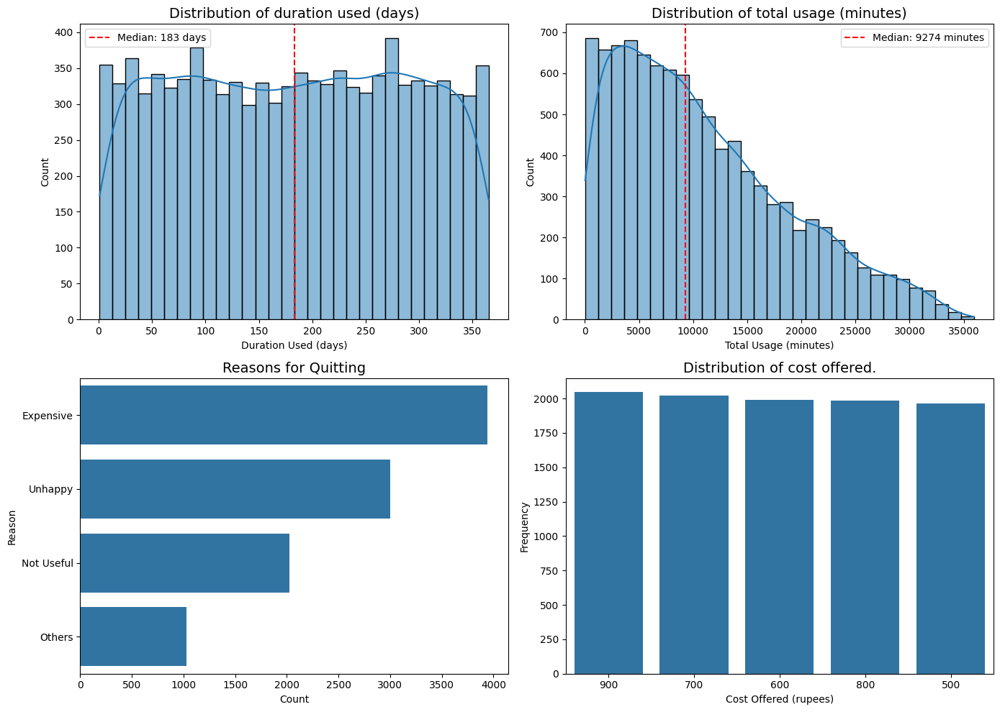
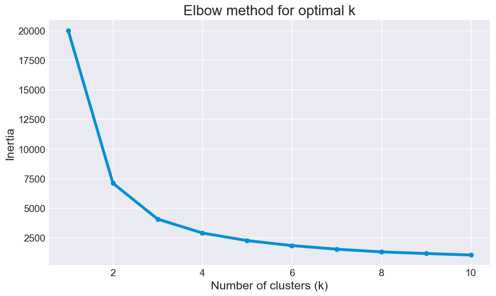
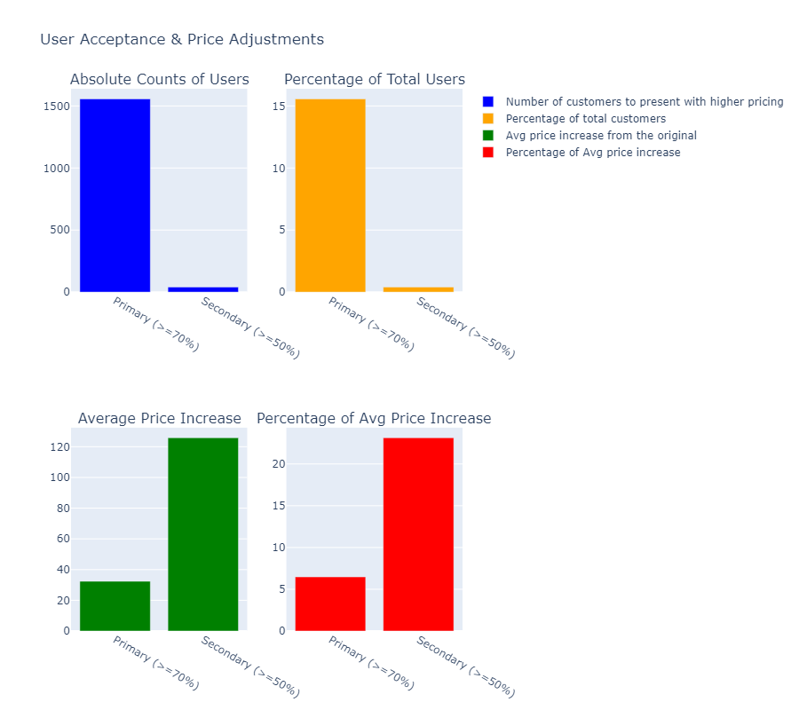

# 📱 Predictive App Usage & Pricing Optimization Using ML

This project analyzes user interaction time with a mobile application and identifies quitting reasons through advanced analytics. The goal is to derive insights and recommend **optimal pricing** and **retention strategies** to enhance user engagement and revenue.

---
## Table of Contents
- [Project Overview](#project-overview)
- [Dataset](#dataset)
- [Modeling Approach](#modeling-approach)
- [Key Insights](#key-insights)
- [Visualizations](#visualizations)
- [How to Run](#how-to-run)
- [Future Improvements](#future-improvements)

## Project Overview
This project explores app usage behavior of 10,000 users to understand quitting reasons, offer acceptance patterns, and usage trends.
In addition, through evaluation and application of different classification models, we predict the highest price a user shall pay based on the predicted acceptance probabilities by the classification model.

---

## Dataset
The dataset includes anonymous app engagement metrics for 10,000 customers with features explaining metrics like:
- Number of days a customer used the app (Duration Used (days))
- Total minutes spent by a customer on the app (Total Usage (minutes))
- Various reasons to quit the app usage (Reason for Qutting)
- Pricing asked for app (Cost Offered (rupees))
- Whether or not user accepted to pay (Accepted Offer)
📄 File used: `App Usage dataset for 10000 customers.csv`

---

## Modeling Approach
- Used random forest classifier for extracting feature importances with accuracy score of approximately 62%. Applied logistic regression model achieving an accuracy of 67%.
- For dynamic pricing, the model predicts the highest price a user would accept based on classification probabilities. 3 classification models namely LogisticRegression, RandomForest, and XGBoost were evaluated based on **cross validation** with **Mean ROC-AUC score** where LogisticRegression outperformed the other two models with a **0.6759** ROC-AUC score.
- A separate function/tool **get_highest_price** was used to determine the best possible price to offer based on the two acceptance threshold probabilities predicted by the model. The maximum optimal price was determined by binary search within a range of possible prices.
- Appropriate practices and implementations were applied throughout the code, like K-fold validation, for prevention of **data leakage** which is a significant problem in model training.

## Key Insights
- **Most common reason for quitting.**: Expensive and Unhappy attributing to 39.4% and 30.0% user quitting respectively.
- **Overall offer acceptance ratio.**: 64.2%
- **Primary reasons for early churners (<90 days)**:
  - Expensive: 38.3%
  - Unhappy: 30.6%
  - Not Useful: 20.7%
  - Others: 10.4%
- **Most important features for predicting offer acceptance.**: Total usage in minutes and duration of days used by a user.
- **Optimal number of clusters (Elbow Method)**: 4
- **Number and share of potential customers driving revenue growth.** 1598 or roughly 16% of the customers can be presented with a higher price given their predicted acceptance is over 50%. Over 1557 had predicted acceptance probability over 70% while 41 customers had >50%.
- **Average price increase per potential user.**: An average price increase of 32.37 was observed for users with a >70% acceptance probability while a cost optimization worth 125.79 rupees was observed for users having acceptance probability over 50%.

## Visualizations
- Some key plots and visualizations from the data analyzed.
- 
- 
- 
- 

## How to Run

### Step 1: Clone the repository

- git clone https://github.com/utkarshere/Predictive-App-Usage-and-Pricing-Optimization-Using-ML.git
- cd App-Usage-analysis--prediction-and-strategic-recommendations

### Step 2: Create a virtual environment

#### Windows:
- python -m venv app_analysis_env
- .\app_analysis_env\Scripts\activate

#### macOS/Linux:
- python3 -m venv app_analysis_env
- source app_analysis_env/bin/activate

### Step 3: Install the dependencies

pip install -r requirements.txt

### Step 4: Run the project

#### Option 1: If you're using a Jupyter Notebook
jupyter notebook app_usage_analysis.ipynb

#### Option 2: If you're running a Python script
python main.py

## Conclusions and Future Improvements
- The analysis identified that over 16% of users are likely to accept a higher price than what was initially offered. However, the model occasionally misclassifies users who actually accepted an offer, predicting them as rejections. For such cases, retaining the original price may be optimal until further model improvements are made. Future enhancements could involve additional feature engineering, inclusion of user behavior over time (e.g., time series usage patterns), or fine-tuning existing models for better calibration and decision thresholds.

